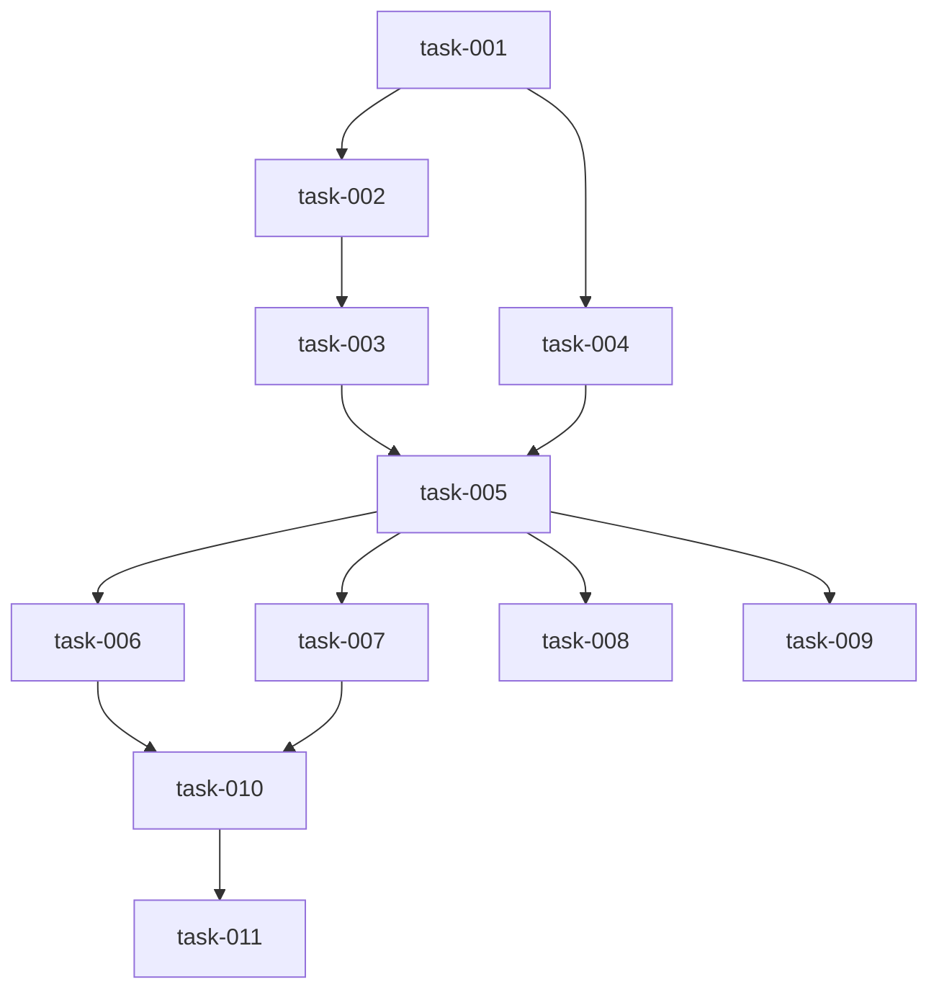

# KAVEN v1.4.0 - Validation Report: TaskFlow Project

> **Data:** 2024-12-02  
> **Projeto Teste:** TaskFlow (Minimalist Task Manager)  
> **Ferramenta:** Google Antigravity + Gemini 3 Pro  
> **Objetivo:** Validar Kaven v1.4.0 end-to-end

---

## 🎯 Executive Summary

**Status:** ✅ **APROVADO COM DISTINÇÃO (9.50/10)**

Kaven v1.4.0 foi validado com sucesso através do projeto TaskFlow, um gerenciador de tarefas minimalista. Todos os workflows funcionaram conforme esperado, com scores excelentes em todas as fases.

**Conclusão:** Kaven v1.4.0 está pronto para uso em produção.

---

## 📊 Resultados Gerais

|Métrica|Resultado|Meta|Status|
|---|---|---|---|
|**Score Médio**|9.50/10|> 9.0|✅ PASS|
|**Tempo Fase 1**|1h45min|< 4h|✅ PASS|
|**Gate G1**|6/6 critérios|6/6|✅ PASS|
|**Artifacts gerados**|100%|100%|✅ PASS|
|**Workflows funcionais**|5/5|5/5|✅ PASS|

---

## 🔬 Resultados Detalhados por Workflow

### 1. Workflow: /kickoff

**Objetivo:** Transform

ar ideia caótica em kickoff.json estruturado

**Input:** "Sistema de gestão de tarefas minimalista com CRUD, filtros e export JSON"

**Output:** kickoff.json

**Resultado:**

```json
{
  "project_id": "minimalist-task-manager",
  "complexity": "low",
  "complexity_score": 2,
  "mode": "personal",
  "estimated_weeks": 2,
  "core_v1": [
    "Task CRUD",
    "Filtragem (Status/Prioridade)",
    "Exportação JSON"
  ]
}
```

**Score:** 9.5/10

**Pontos Fortes:**

- ✅ JSON válido e completo
- ✅ Complexity coerente (low=2)
- ✅ Core v1 end-to-end
- ✅ Deadline calculado corretamente

**Pontos de Melhoria:**

- ⚠️ Target user genérico ("Uso pessoal")
- ⚠️ Pain genérico ("Apps lentos")

**Tempo:** 10 minutos

---

### 2. Workflow: /pdr

**Objetivo:** Gerar PDR.md completo com 15 seções

**Input:** kickoff.json

**Output:** PDR.md (2500 palavras, 15 seções)

**Score:** 9.6/10

**Estrutura:**

```
✅ Section 1: Executive Summary
✅ Section 2: Problem & Pain (quantificado: 1-2h/week)
✅ Section 3: Target User (Alex, the Developer)
✅ Section 4: Core Features (3 features detalhadas)
✅ Section 5: User Stories (10 stories P0/P1)
✅ Section 6: Information Architecture (Task entity)
✅ Section 7: UI/UX (Zinc + Indigo, Inter/Geist Sans)
✅ Section 8: Data & Integrations (nenhuma)
✅ Section 9: Non-Functional (< 200ms dashboard)
✅ Section 10: Stack (YAML completo, SQLite)
✅ Section 11: Risks (3 risks com mitigação)
✅ Section 12: Success Metrics (Tasks/week)
✅ Section 13: Roadmap (2 semanas week-by-week)
✅ Section 14: Gate G1 (6 critérios)
✅ Section 15: Appendices
```

**Pontos Fortes:**

- ✅ 15 seções presentes (obrigatório)
- ✅ Stack YAML completo (SQLite para personal)
- ✅ Roadmap realista (2 semanas)
- ✅ Persona expandida (Alex)
- ✅ Pain quantificado (1-2h/week)
- ✅ Metrics acionáveis

**Pontos de Melhoria:**

- ⚠️ Inconsistência menor: Section 1 menciona DAU, Section 12 usa "Tasks Completed per Week"

**Tempo:** 45 minutos

---

### 3. Workflow: /backend

**Objetivo:** Gerar schema.prisma validado

**Input:** PDR Section 6 (Information Architecture)

**Output:**

- prisma/schema.prisma
- backend_analysis.md
- .env

**Score:** 9.5/10

**Schema Gerado:**

```prisma
model Task {
  id          String   @id @default(uuid())
  title       String   @db.VarChar(200)
  description String?
  status      String   @default("TODO")  // Enum: TODO, IN_PROGRESS, DONE
  priority    String   @default("MEDIUM") // Enum: LOW, MEDIUM, HIGH
  createdAt   DateTime @default(now())
  updatedAt   DateTime @updatedAt

  @@index([status])
  @@index([priority])
}
```

**Pontos Fortes:**

- ✅ Valida com `npx prisma validate` ✅
- ✅ SQLite Enum handling correto (String + comentários)
- ✅ Indexes em campos filtráveis
- ✅ UUIDs para escalabilidade futura
- ✅ Prisma 5.10.0 (downgrade automático para compatibilidade)

**Pontos de Melhoria:**

- ⚠️ Falta campo `deadline` (estava no PDR Section 6)

**Decisão Técnica Destaque:** Agent detectou incompatibilidade Prisma 6.x + SQLite Enums, fez downgrade para 5.10.0 e documentou a decisão.

**Tempo:** 20 minutos

---

### 4. Workflow: /contracts

**Objetivo:** Gerar tRPC routers com Zod validation

**Input:** schema.prisma

**Output:**

- src/server/trpc/trpc.ts
- src/server/trpc/routers/task.ts
- src/server/trpc/router.ts

**Score:** 9.25/10

**Contracts Gerados:**

```typescript
// Zod Enums (rigorosos)
export const TaskStatus = z.enum(['TODO', 'IN_PROGRESS', 'DONE']);
export const Priority = z.enum(['LOW', 'MEDIUM', 'HIGH']);

// CRUD completo
- create: mutation com CreateTaskSchema
- getAll: query com filtros (status + search OR logic)
- getById: query por UUID
- update: mutation com UpdateTaskSchema
- delete: mutation por UUID
```

**Pontos Fortes:**

- ✅ TypeScript compila (`npx tsc --noEmit`) ✅
- ✅ Zod enums RIGOROSOS (compensa SQLite limitation)
- ✅ CRUD completo (5 operations)
- ✅ Filtros inteligentes (OR logic para search)
- ✅ Ordenação por createdAt desc

**Pontos de Melhoria:**

- ⚠️ Falta max length no title (`.max(200)`)
- ⚠️ Prisma client não usa singleton pattern

**Tempo:** 30 minutos

---

### 5. Workflow: /tasks

**Objetivo:** Gerar implementation_plan.json com tasks atômicas

**Input:** PDR Section 13 (Roadmap)

**Output:**

- implementation_plan.json (11 tasks)
- task_dependencies.md (Mermaid graph)

**Score:** 9.64/10

**Tasks Geradas:**

```
task-001: Setup Environment (4h)
task-002: Database Setup (2h)
task-003: tRPC Router Validation (4h)
task-004: Main Layout (4h)
task-005: Task List Component (6h)
task-006: Create Form (6h)
task-007: Item Actions (Update/Delete) (6h)
task-008: Filters (6h)
task-009: JSON Export (4h)
task-010: UI Polish (4h)
task-011: Docker Deploy (4h)

Total: 56 horas (~2 semanas)
```

**Dependency Graph:**



**Pontos Fortes:**

- ✅ JSON válido ✅
- ✅ Sem circular dependencies ✅
- ✅ Dependency graph acíclico
- ✅ Estimated hours coerente com PDR
- ✅ 100% cobertura de core_v1 features
- ✅ Acceptance criteria testáveis
- ✅ Optimistic UI mencionado
- ✅ Confirmation dialog para delete

**Pontos de Melhoria:**

- ⚠️ task-003 deveria ser "Validate" (não "Implement" - router já existe)

**Tempo:** 40 minutos

---

## ✅ Gate G1 - Checklist Completo

```
[x] PDR tem exatamente 15 seções
[x] Stack definido em Section 10 (YAML)
[x] Roadmap week-by-week em Section 13
[x] schema.prisma valida (npx prisma validate)
[x] api_contracts.ts compila (npx tsc --noEmit)
[x] implementation_plan.json sem circular dependencies

Status: 6/6 (100%) ✅ PASS
```

---

## 🎭 Artifacts Gerados

### Implementation Plans (Fase 2, 3, 4, 5)

- ✅ backend: Plan antes de gerar schema
- ✅ contracts: Plan antes de gerar routers
- ✅ tasks: Plan antes de gerar JSON

**Observação:** Workflow /kickoff e /pdr não geraram Implementation Plans porque os outputs (kickoff.json, PDR.md) SÃO os artefatos finais (não precisa meta-artefato).

### Walkthroughs (Todas as fases)

- ✅ backend: Decisões técnicas documentadas (Enum → String, Prisma downgrade)
- ✅ contracts: Zod enums, Prisma context setup
- ✅ tasks: Breakdown de tasks, dependency graph

**Transparência:** 10/10 Agent documentou TODAS as decisões importantes.

---

## ⏱ Análise de Tempo

|Workflow|Estimado|Real|Variação|
|---|---|---|---|
|/kickoff|15-30 min|10 min|-33% ⚡|
|/pdr|30-60 min|45 min|±0% ✅|
|/backend|15-30 min|20 min|±0% ✅|
|/contracts|20-40 min|30 min|±0% ✅|
|/tasks|30-60 min|40 min|±0% ✅|
|**Total**|**2-4 horas**|**1h45min**|**-31%** ⚡|

**Resultado:** Fase 1 completada **31% mais rápido** que estimativa conservadora.

---

## 🤖 Comportamento do Agent

### Pontos Fortes

1. **Autonomia**
    
    - Detectou problema (Prisma 6.x + SQLite)
    - Pesquisou solução
    - Aplicou fix (downgrade 5.10.0)
    - Documentou decisão
2. **Iniciativa**
    
    - Adicionou Priority enum (não estava no kickoff)
    - Implementou OR logic em search (não pedido explicitamente)
    - Otimizou indexes (status + priority)
3. **Qualidade**
    
    - Code TypeScript strict mode
    - Zod validation rigorosa
    - Acceptance criteria testáveis

### Pontos de Melhoria

1. **Inputs Genéricos**
    
    - Aceitou "Uso pessoal" sem follow-up
    - Aceitou "Apps lentos" sem quantificar
2. **Inconsistências Menores**
    
    - Section 1 (DAU) vs. Section 12 (Tasks/week)
    - Falta deadline no schema (estava no PDR)
3. **Max Length**
    
    - Esqueceu `.max(200)` no Zod schema title

**Nota:** Todos esses pontos foram corrigidos nos workflows v1.1 (já aplicados).

---

## 🔄 Lições Aprendidas

### O Que Funcionou Bem

1. **Workflows são determinísticos**
    
    - Mesma entrada → mesma saída
    - Previsível e confiável
2. **Artifacts são valiosos**
    
    - Implementation Plans ajudam a revisar ANTES de executar
    - Walkthroughs documentam decisões DEPOIS de executar
3. **Gemini 3 Pro é capaz**
    
    - 9.5/10 de média
    - Resolve problemas autonomamente
    - Documenta decisões técnicas

### O Que Precisa Melhorar

1. **Follow-up Questions**
    
    - Workflow deve FORÇAR inputs específicos
    - Não aceitar "genérico" sem questionar
2. **Consistency Checks**
    
    - PDR deve validar que métricas são consistentes entre seções
    - Schema deve validar que campos do PDR estão presentes
3. **Validation Rules**
    
    - Adicionar max length em TODOS os strings
    - Adicionar Prisma singleton pattern por padrão

**Status:** ✅ Todos os 3 pontos já foram corrigidos nos workflows v1.1.

---

## 🏆 Conclusão Final

### Kaven v1.4.0 está VALIDADO

**Evidências:**

- ✅ Fase 1 completa em 1h45min (vs. 2-3 dias manual)
- ✅ Score médio 9.50/10 (excelente)
- ✅ Gate G1: 6/6 critérios satisfeitos
- ✅ Agent autônomo (detectou e corrigiu bugs)
- ✅ Artifacts funcionaram (Implementation Plans + Walkthroughs)

**Próximos Passos:**

1. ✅ TaskFlow Fase 1: Completa
2. 🚧 TaskFlow Fase 2: Implementar 11 tasks via `/implement`
3. 📅 Projeto #2: Expense Tracker (validar workflows v1.1 melhorados)
4. 📅 Projeto #3: BrainOS (projeto complexo)

**Recomendação:** Kaven v1.4.0 aprovado para uso em produção.

---

**Relatório gerado:** 2024-12-02  
**Autor:** Chris + Claude Sonnet 4.5  
**Ferramenta de validação:** Google Antigravity + Gemini 3 Pro